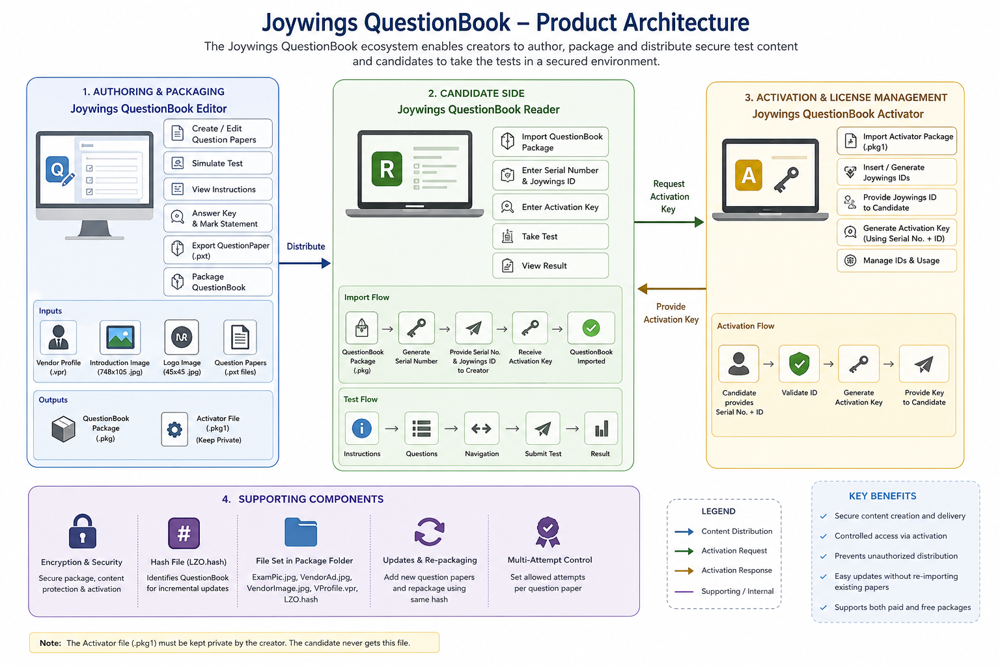
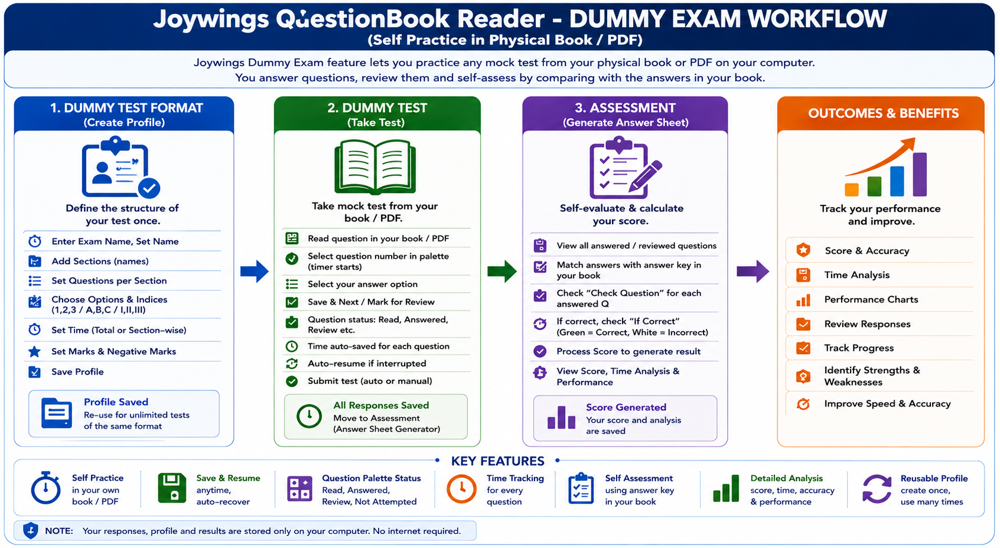

<div align="center"> 
 
# 📘 Joywings QBERA System
## QuestionBook Editor . Reader . Activator Platform
### Offline Examination & Licensing Platform
 
**Developed under the Joywings Inc. product identity (2016–2020)**  
*(Informal product brand, not a legally registered company)*

---


---

An Offline Examination Platform with Question Authoring, Packaging, Distribution and Licensing System.

## 📥 Downloads
 
### 🚀 Latest Release
 
| Application | Version | Download |
|------------|---------|----------|
| 🖥️ QuestionBook Reader | 2.1.17 | [⬇ Download Installer](../../releases/latest) |
| 🧩 QuestionBook Editor | 1.1.55 | [⬇ Download Installer](../../releases/latest) |
| 📜 Detailed Documentation | 1.3 | [⬇ Download Documentation](docs/Joywings%20QB%20Reader%20-%20Editor%20-%20Activator%20Documentation_1.3.pdf) |

> ⚠️ Note: Installers are available under the GitHub Releases section.
 
</div>
 
---
 
# 📖 Overview
 
The **Joywings QBERA System** is a complete desktop-based examination ecosystem designed for educational institutes, coaching classes, training organizations, and self-learning platforms.
The system consists of three core applications:

- Joywings QuestionBook Editor
- Joywings QuestionBook Reader
- Joywings QuestionBook Activator

The system enables content creators to:
 
- Create question papers
- Package them into distributable exam books
- Distribute them to candidates
- Conduct offline examinations
- Protect premium content using activation keys
  
 > QBERA (Pronounced as 'Kyubera') is an acronym derived from the initials of these three components - QuestionBook Editor, Reader and Activator. It represents the complete examination, packaging and licensing platform. 

--- 
# ✨ Key Features
 
## 📝 Question Authoring
 
- Multiple sections
- MCQ questions
- Comprehension-based questions
- Explanations
- Negative marking
- Rich text formatting support
- MS Word integration workflow
 
## 📦 Packaging System
 
- Export question papers
- Bundle multiple tests
- Vendor branding support
- Package logo support
- Package introduction screen
 
## 🖥️ Examination Engine
 
- Offline test environment
- Exam timer
- Section navigation
- Question palette
- Resume interrupted exams
- Auto-save functionality
 
## 📊 Performance Analytics
 
- Exam score history
- Dummy test statistics
- Performance charts
- Question review system
 
## 🔐 Licensing System
 
- Serial number generation
- Activation key generation
- Device binding
- Package integrity validation
 
---
 
# 🏗️ QBERA Architecture




---
 
# 📦 QBERA Applications
 
## 🧩 Joywings QuestionBook Editor (JQE)
 
Creates and edits question papers.
 
### Features
 
- Create question papers
- Edit questions
- Manage answers
- Manage explanations
- Preview exams
- Simulate candidate experience
- Export to .PXT
 
---
 
## 🖥️ Joywings QuestionBook Reader (JQR)
 
Used by candidates.
 
### Features
 
- Import QuestionBooks
- Attempt exams
- Practice dummy tests
- Review answers
- Analyze performance
- Track scores
 
---
 
## 🔐 Joywings QuestionBook Activator (JQA)
 
License management system.
 
### Features
 
- Generate Joywings IDs
- Generate Activation Keys
- Validate Serial Numbers
- Manage licensed content
 
---
 
# 🔄 Workflow
 
## Content Creator
 
```text
Create Questions
        ↓
Export .PXT
        ↓
Package .PKG
        ↓
Distribute to Students
```
 
## Candidate
 
```text
Import Package
        ↓
Generate Serial Number
        ↓
Receive Activation Key
        ↓
Unlock QuestionBook
        ↓
Attempt Tests
```
 
---
 
# 🔐 Licensing Design
 
The licensing architecture is based on:
 
- Package Identity
- Package Hash
- Joywings ID
- Device Serial Number
 
Result:
 
- Offline activation
- Machine-bound licenses
- Package integrity verification
- Premium content protection
 
---
 
# 📁 File Formats
 
| Extension | Description |
|------------|-------------|
| .qst | Question Paper |
| .ans | Answer Key |
| .exp | Explanations |
| .pxt | Exported Question Paper |
| .pkg | QuestionBook Package |
| .hash | Package Integrity File |
| .vpr | Vendor Profile |
 
---
 
# 🛠 Technologies
 
### Development
 
- Visual Basic 6 (Earlier versions)
- VB.NET
- C#
- .NET Framework
- Windows Desktop Development
 
### Components
 
- Rich Text Processing
- File Packaging System
- Cryptographic Hashing
- Offline Licensing Engine
  
# 🎯 Real-World Problems Solved
 
✅ Offline Examination Delivery
 
✅ Premium Question Bank Protection
 
✅ Coaching Institute Distribution Model
 
✅ Candidate Performance Tracking
 
✅ Exam Packaging and Distribution
 
✅ License-Controlled Educational Content
 
---
 
# 💡 Technical Highlights
 
This project demonstrates experience in:
 
- Desktop Application Development
- Product Design
- Licensing Systems
- Data Packaging
- File Format Design
- Rich Text Processing
- Educational Software Development
- User Experience Design
- Offline-first Architecture
 
---
 
# 👨‍💻 About the Author
 
### Pramod R. Gajbhiye
 
Senior .NET Developer | Independent Software Developer
 
Areas of Interest:
 
- .NET Development
- ASP.NET Core
- Desktop Applications
- Educational Software
- SaaS Products
- WPF
- .NET MAUI 
---
 
# ⭐ Why This Project Matters
 
Unlike a simple CRUD application, this project includes:
 
- Content authoring tools
- Examination engine
- Packaging framework
- Licensing system
- Activation workflow
- Analytics dashboard
 
Making it a complete end-to-end software product rather than a standalone application.
 
---
 
# 📸 Screenshots
 
## Joywings QuestionBook Reader
#### Welcome Window 


#### Exam Simulation

 
---
 
## Joywings QuestionBook Editor
#### Opening Window 


#### Opened Question Paper


---
 
## Joywings QuestionBook Activator
 

 > Additional screenshots are available in the [screenshots](./scrrenshots) folder.
---
 
# 📄 License
 
This repository is published for portfolio and demonstration purposes.
 
All rights reserved by the author.
