### Installation
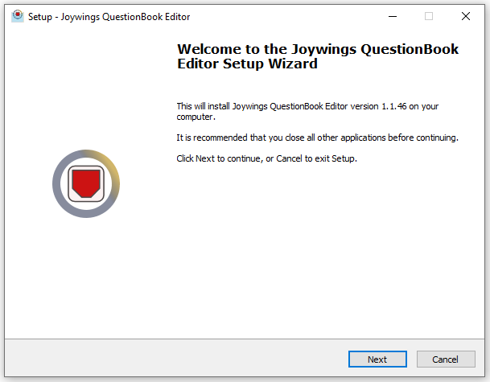

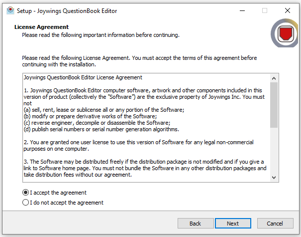

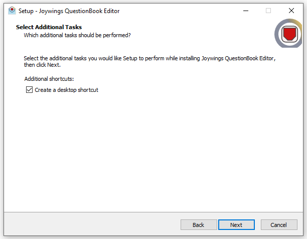

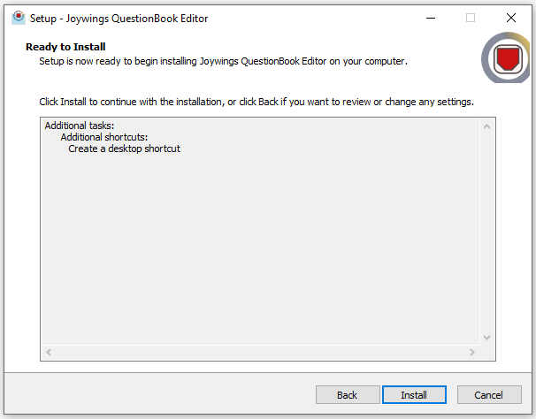

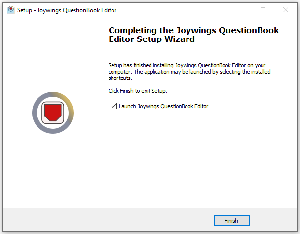

### Creating profile
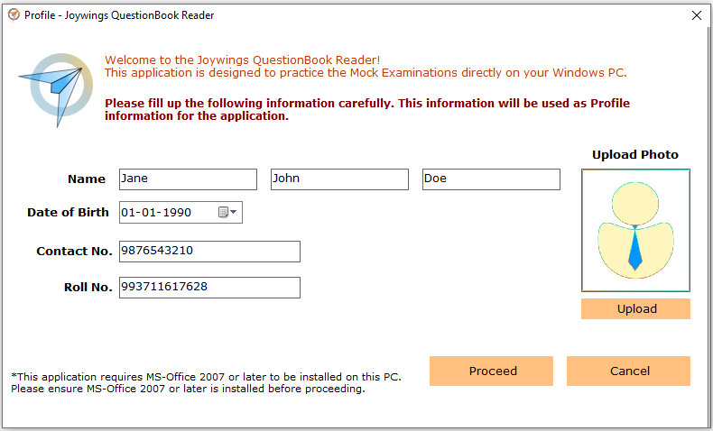

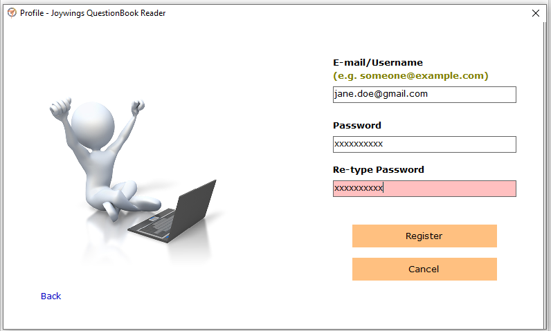

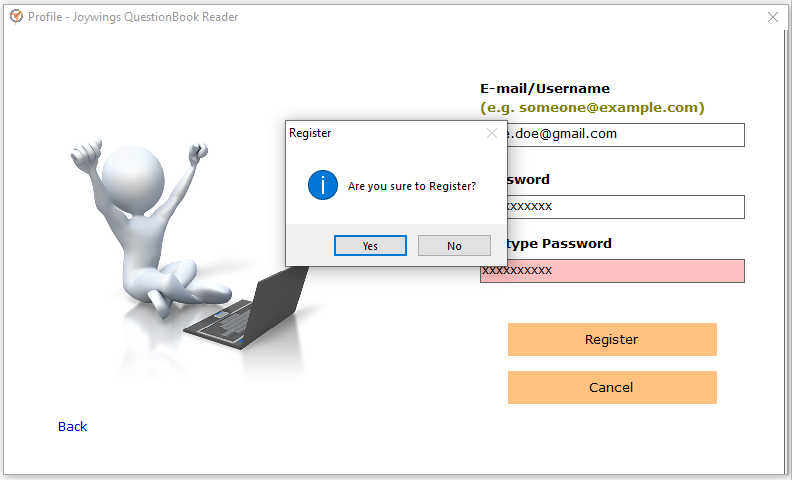

### Vendor registration
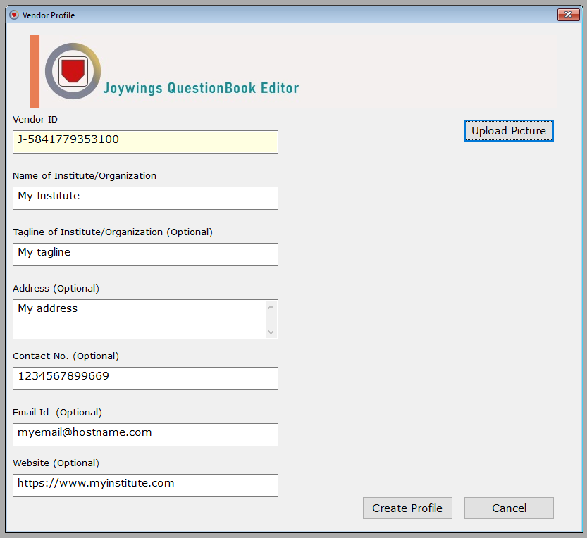

### Editor home
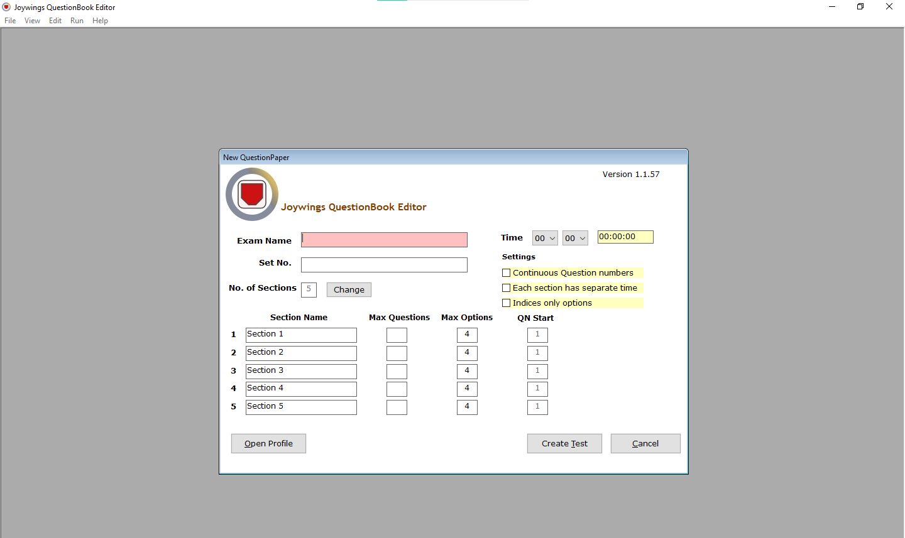

### Automatic instructions generation

### View Mark statements and answer key

### View automatically generated instructions simulation
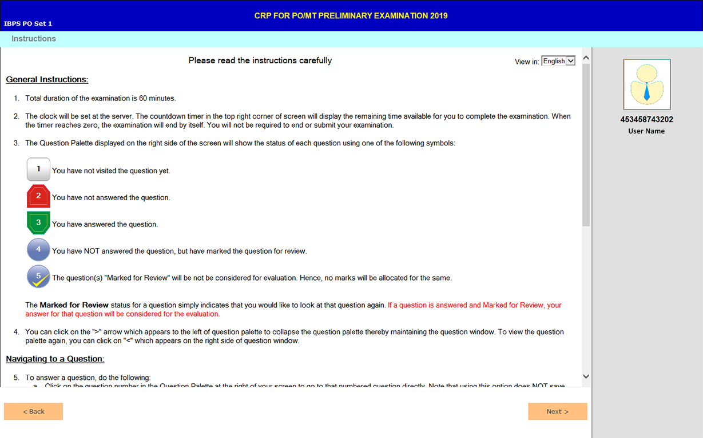

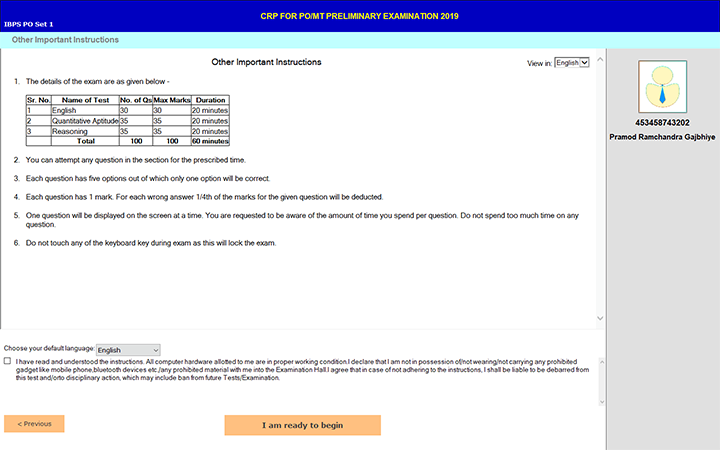

### Packaging question papers in QuestionBooks
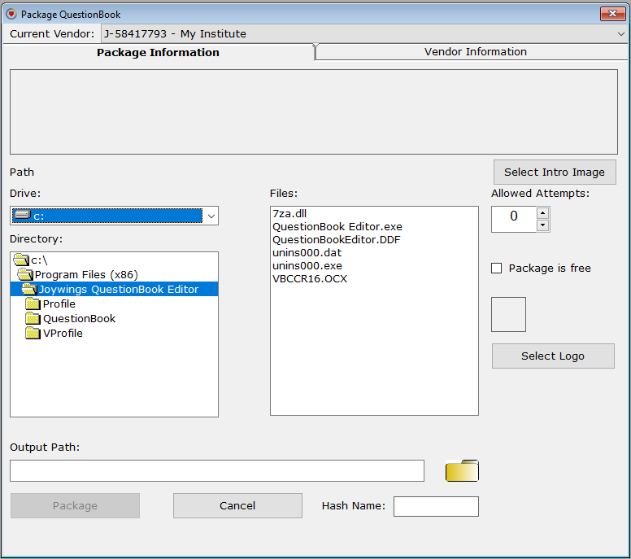

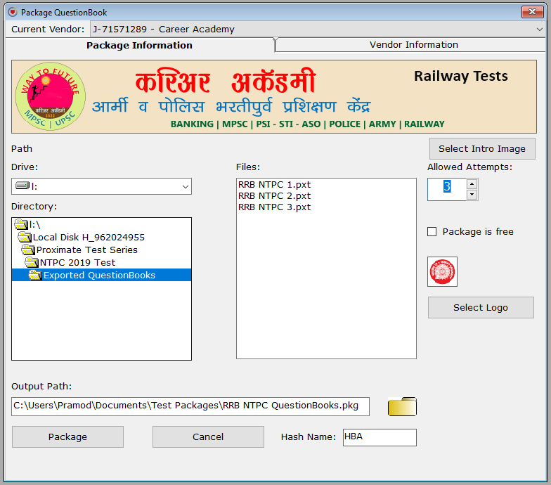

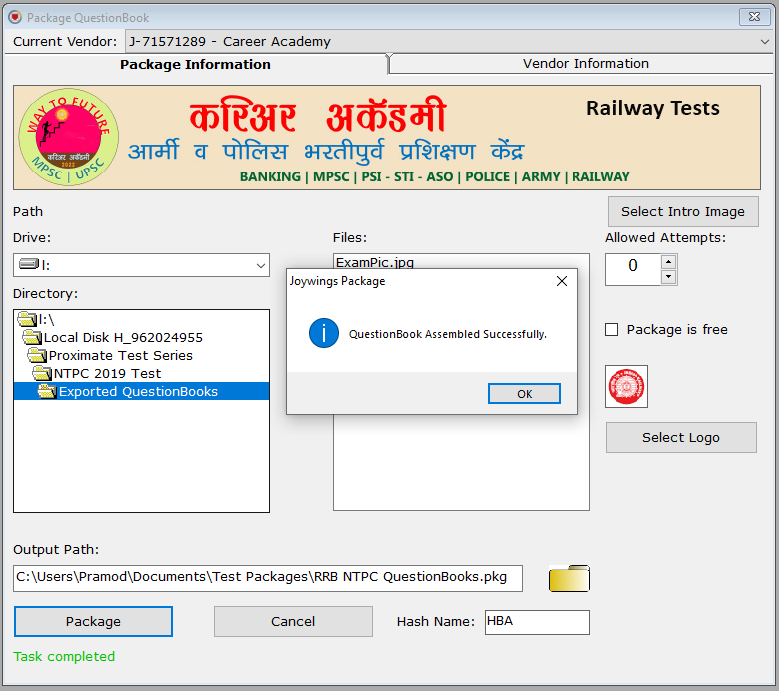

